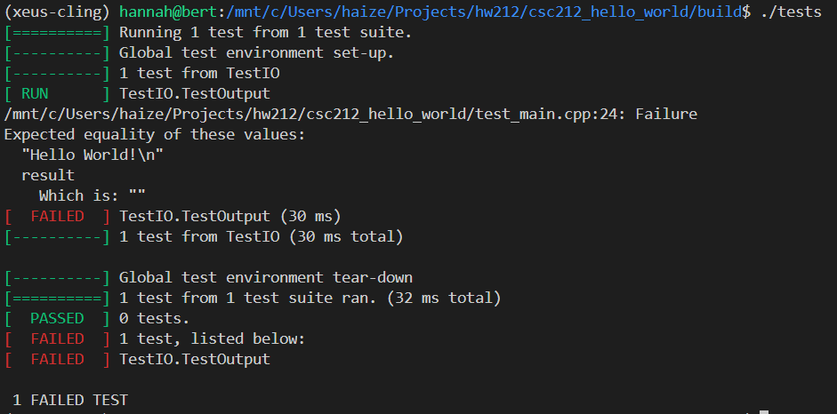

Hello World
==============

Task: Write a program that prints "Hello World!". 

The goal of this assignment is to gain familarity with github classroom, cmake, and the gtest unit testing framework. 

1. Clone your homework repository (accessed via github classroom link) to your local machine. 
2. On the command line, navigate to the directory containing the homework starter code.
3. Use cmake to compile the code and tests:
    ``` bash
    mkdir build
    cd build
    cmake ..
    make
    ```
4. Run the tests:
```bash
./tests
```
Since main.cpp is empty, the tests will fail. The `./tests` command will produce something like the following output:


5. Edit main.cpp and run make again. This will produce an executable named 'main'. Running the command `./main` must produce the following output:
```bash
Hello World!
```

6. Run 'tests' again. Something like the following will print when all tests pass:


7. Everytime the code is changed and a test passes, I recommend committing the change to the code:
```bash
git add main.cpp
git commit -m "passed print test" 
```
Note that the message should be specific to each test. 

8. Push the passing code to the homework repository:
```bash
git push
```


**Note:**  You must match the output exactly (including spelling, capitalization, punctuation, and spacing). 

