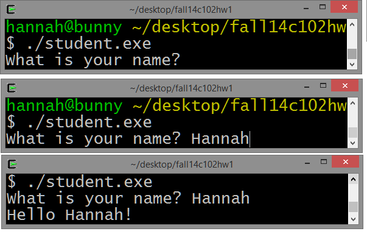

Coding Problem
==============

Write a program that asks the user for their name and then prints out a welcome message.

1. When the program begins, prompt the user for their name. Use the following wording (verbatim):
                  
        What is your name? 

2. The user will then enter in their name.
                   

3. Then print out: 

        Hello <name!>
                            
4. For example, a fully working program would output the following. 
Note: The user inputted Hannah. 

**Note:**  You must match the output exactly (including spelling, capitalization, punctuation, and spacing). 

